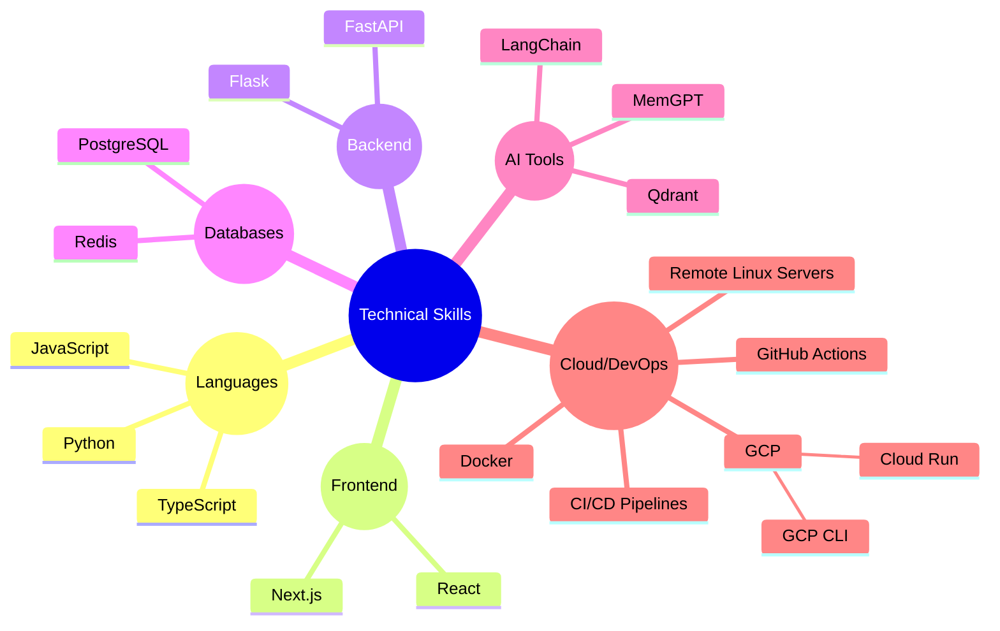

# 👋 Hi, I'm Himanshu Rathore  
### 💻 Full Stack Engineer | AI/ML Enthusiast | Agentic AI Dev  

🚀 Software Engineer at **[HashInclude](https://www.hashinclude.in/)** | Engineer at the intersection of code and intelligence — building full-stack apps with an AI edge.
Dedicated to pushing boundaries in ML and agentic AI development.

### ⚡ Tech Snapshot

### 

### 🤝 Connect with Me  
[🌐 Portfolio](https://himanshu2561.netlify.app/) · [💼 LinkedIn](https://linkedin.com/in/rathore25himanshu) · [🧑‍💻 GitHub](https://github.com/himanshu2561) · 📧 **himanshu.rathore2561@gmail.com**

Thanks for visiting! ✨ Let's build something awesome together.
