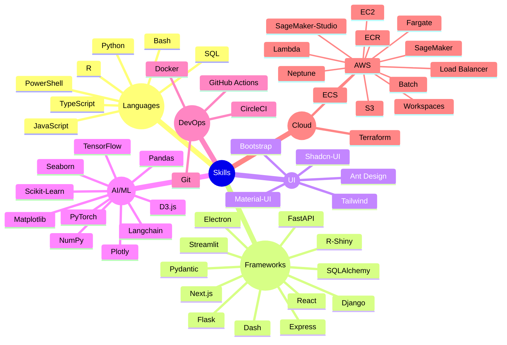

# 👋 Hi, I'm Himanshu Rathore  
### 💻 Full Stack Engineer | AI/ML Enthusiast | Agentic AI Dev  

🚀 Software Engineer at **[HashInclude](https://www.hashinclude.in/)** | Building scalable platforms at the intersection of **data, AI/ML, and infra**. Passionate about developer experience, product thinking, and intelligent systems.

### ⚡ Tech Snapshot

### 🤝 Connect with Me  
[🌐 Portfolio]() · [💼 LinkedIn](https://linkedin.com/in/rathore25himanshu) · [🧑‍💻 GitHub](https://github.com/himanshu2561) · 📧 **himanshu.rathore2561@gmail.com**

Thanks for visiting! ✨ Let's build something awesome together.
